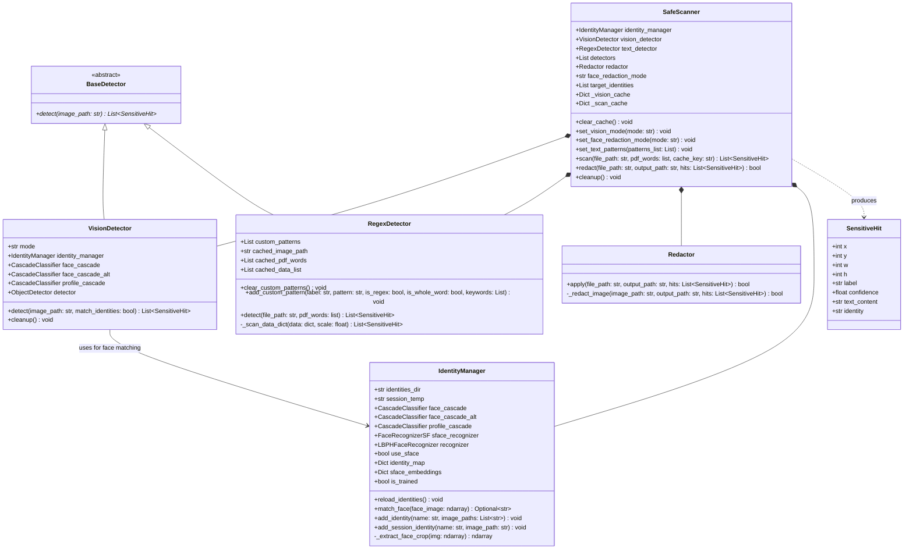
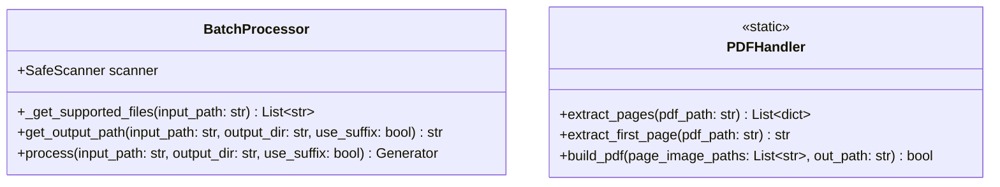
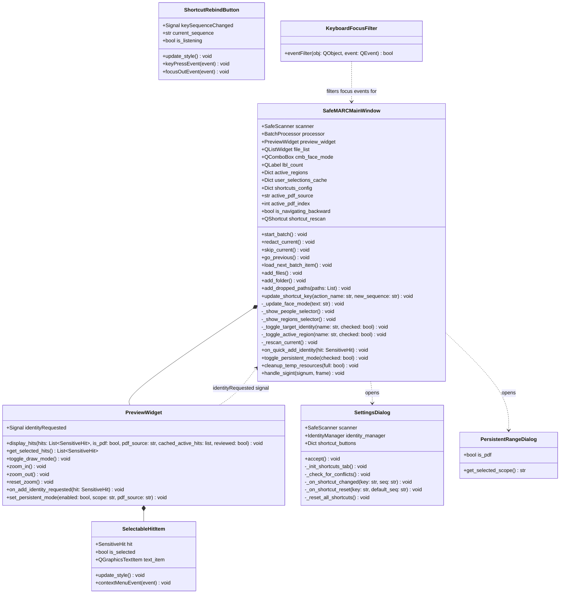

# SafeMARC UML Class Architecture

This document contains a comprehensive UML class diagram detailing the properties, methods, and relationships between the core classes of the SafeMARC application.

## Core & Detection Layer

---

## Processing & Handler Layer

---

## UI Layer (PySide6 Desktop Application)

