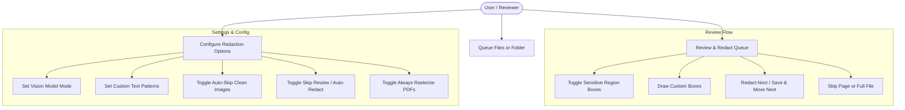

# SafeMARC Use Case Diagrams & Scenarios

This document explains exactly how users interact with the SafeMARC system via comprehensive use case diagrams.

## Use Case Diagram

---

## Detailed Use Cases

### UC1: Manage & Append File Queue
- **Actors**: User
- **Preconditions**: Application is open.
- **Trigger**: User clicks "Add Files" or "Add Folder" buttons.
- **Main Workflow**:
  1. User selects valid supported file types (`.png`, `.jpg`, `.jpeg`, `.pdf`, `.webp`, `.bmp`, `.tiff`).
  2. Queue validates file paths and displays them cleanly.

### UC2: Manual and Automated Review
- **Actors**: User
- **Preconditions**: Queue contains files.
- **Trigger**: User clicks "Start Review".
- **Main Workflow**:
  1. The application parses the current queue item.
  2. If it's a PDF, pages are extracted as temporary high-fidelity images.
  3. The scanning engine uses computer vision (MediaPipe) and text patterns to map sensitive hits.
  4. The user toggles boxes or creates custom redaction shapes via the Draw Tool (`D`).
  5. The user submits via "Redact Next", skips with "Skip", or navigates back with "Go Previous".
  6. On skipping, the user can choose to skip the active PDF page or skip the entire PDF file.
  7. Redactions are burned directly onto output images or rebuilt into a sanitized PDF.
