# SafeMARC Use Case Diagrams & Scenarios

This document explains exactly how users interact with the SafeMARC system via comprehensive use case diagrams.

## Use Case Diagram

```mermaid
graph TD
    User([User / Reviewer]) --> UC1[Queue Files or Folder]
    User --> UC2[Review & Redact Queue]
    User --> UC3[Configure Redaction Options]
    User --> UC4[Manage Identities]
    User --> UC5[Rebind Keyboard Shortcuts]
    
    subgraph Queue Management
        UC1 --> UC1_A[Add Files via Dialog]
        UC1 --> UC1_B[Add Folder via Dialog]
        UC1 --> UC1_C[Drag & Drop Files/Folders]
    end

    subgraph Review Flow
        UC2 --> UC2_A[Toggle Sensitive Region Boxes]
        UC2 --> UC2_B[Draw Custom Boxes]
        UC2 --> UC2_C[Redact Next / Save & Move Next]
        UC2 --> UC2_D[Skip Page or Full File]
    end

    subgraph Settings & Config
        UC3 --> UC3_A[Set Vision Model Mode]
        UC3 --> UC3_B[Set Custom Text Patterns]
        UC3 --> UC3_C[Set Face Redaction Mode]
        UC3 --> UC3_D[Select Target Identities]
        UC3 --> UC3_E[Toggle Auto-Skip Clean Images]
        UC3 --> UC3_F[Toggle Skip Review / Auto-Redact]
        UC3 --> UC3_H[Adjust Face Detection Threshold Slider]
        UC3 --> UC3_I[Adjust Text Auto-Redact Confidence Slider]
    end

    subgraph Identity Management
        UC4 --> UC4_A[Add Identity from Reference Images]
        UC4 --> UC4_B[Quick-Add Identity via Right-Click]
        UC4 --> UC4_C[Remove Identity]
        UC4 --> UC4_D[Session-Only Identity]
    end

    subgraph Keyboard Shortcut Settings
        UC5 --> UC5_A[View Active Keyboard Shortcuts]
        UC5 --> UC5_B[Rebind Action Keyboard Shortcut]
        UC5 --> UC5_C[Verify Keybinding Conflicts]
        UC5 --> UC5_D[Reset Individual or All Shortcuts]
    end
```

---

## Detailed Use Cases

### UC1: Manage & Append File Queue
- **Actors**: User
- **Preconditions**: Application is open.
- **Trigger**: User clicks "Add Files", "Add Folder", or drags files onto the queue.
- **Main Workflow**:
  1. User selects valid supported file types (`.png`, `.jpg`, `.jpeg`, `.pdf`, `.webp`, `.bmp`, `.tiff`).
  2. Folders are recursively scanned for supported files.
  3. Queue validates file paths, deduplicates, and displays them cleanly.

### UC2: Manual and Automated Review
- **Actors**: User
- **Preconditions**: Queue contains files.
- **Trigger**: User clicks "Start Review".
- **Main Workflow**:
  1. The application parses the current queue item.
  2. If it's a PDF, pages are extracted as temporary high-fidelity images.
  3. The scanning engine uses computer vision (Haar Cascade for faces, MediaPipe for bodies) and text patterns to map sensitive hits.
  4. If face mode is Blacklist or Whitelist, detected faces are matched against known identities using SFace DNN recognition.
  5. Hits are filtered based on the active face redaction mode and selected target identities.
  6. The user toggles boxes or creates custom redaction shapes via the Draw Tool (`D`).
  7. The user can press `F5` at any point to rescan the current document with the active regional and text pattern filters while preserving custom manual selections.
  8. The user submits via "Redact Next", skips with "Skip", or navigates back with "Go Previous".
  9. On skipping, the user can choose to skip the active PDF page or skip the entire PDF file.
  10. On going previous to a completed PDF in the queue, the user is prompted to restart the PDF from Page 1 to ensure a clean compilation stack.
  11. Redactions are burned directly onto output images or rebuilt into a sanitized PDF.

### UC3: Configure Redaction Settings & Thresholds
- **Actors**: User
- **Preconditions**: Application is open.
- **Trigger**: User opens settings or updates dropdown configurations.
- **Configurations**:
  - **Face Redaction Mode**:
    - **All**: Redact every detected face (default).
    - **Blacklist**: Only redact faces that match selected target identities.
    - **Whitelist**: Redact all faces *except* those matching selected target identities.
  - **Dynamic Threshold Adjustments**:
    - **Text Auto-Redact Cutoff Slider**: Customizes the minimum confidence score (0-100%) needed for a text hit to be automatically marked for redaction. Low-confidence matches falling below this cutoff trigger an amber outline/suggested review state.
    - **Face Detection Sensitivity Slider**: Adjusts the MediaPipe ObjectDetector score threshold (10-90%) for body silhouettes, preventing false body matches or allowing faint body detections.
- **Target Selection**: User clicks the "People" button to toggle identity checkboxes.

### UC4: Manage Identities
- **Actors**: User
- **Preconditions**: Application is open.
- **Trigger**: User opens Settings > Identities tab, or right-clicks a detected face.
- **Main Workflow**:
  1. User can add a new identity by providing a name and uploading reference images.
  2. If the added image contains a face, the AI automatically detects and focuses on it. If not, or to refine it, the user can adjust a 1:1 aspect-ratio-locked interactive crop bounding box.
  3. User can view all reference image thumbnails on the right panel. Clicking the "X" on the top corner of any thumbnail deletes that specific image and immediately sweeps its biometric `.npy` cache embeddings.
  4. User can multi-select several identities on the left pane (Ctrl+Click, Shift+Click, or Drag) and delete them in a single batch click.
  5. Quick-add: Right-click a detected face in preview → name it → save permanently or for session only.
  6. Session-only identities are automatically deleted on next app launch.
  7. The recognition model retrains immediately after any identity change.

### UC5: Configure Keyboard Shortcuts Rebinding
- **Actors**: User
- **Preconditions**: Settings Dialog is open.
- **Trigger**: User clicks the "Shortcuts" tab inside the Settings Dialog.
- **Main Workflow**:
  1. The user views a categorized, scrollable list of all 24 keyboard actions and their current keybindings.
  2. The user clicks the "Rebind" button next to any action, which starts listening for the next keypress/combination.
  3. The user presses the new key sequence (including modifiers like `Ctrl`, `Shift`, `Alt`, `Meta`). The button updates its text to show the new sequence.
  4. The system validates the new shortcut sequence in real time. If the shortcut is already in use by another action, a red warning text is displayed listing all conflicting actions.
  5. The user can click "Reset" next to any rebound shortcut to revert it to its default, or click "Reset All Shortcuts to Defaults" to reset all shortcuts at once.
  6. Settings are saved in `QSettings` and dynamically applied to the main window shortcuts instantly without requiring an application restart.

