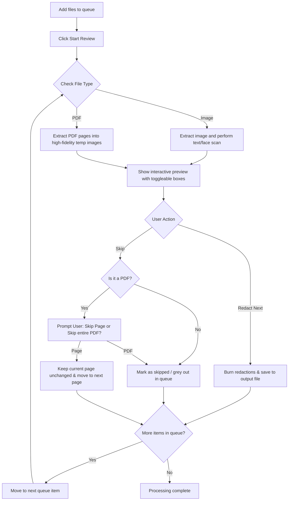
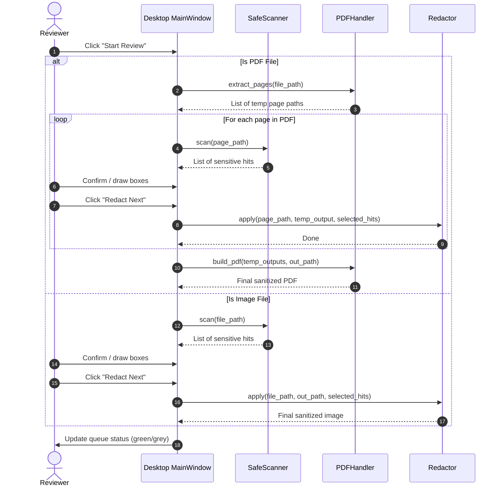

# SafeMARC System Workflows

This document explains exactly how SafeMARC processes files and manages review loops through detailed Mermaid diagrams.

## Document Redaction Workflow

---

## Processing & Redaction Sequence Diagram

