# SafeMARC System Workflows

This document explains exactly how SafeMARC processes files and manages review loops through detailed Mermaid diagrams.

## Document Redaction Workflow

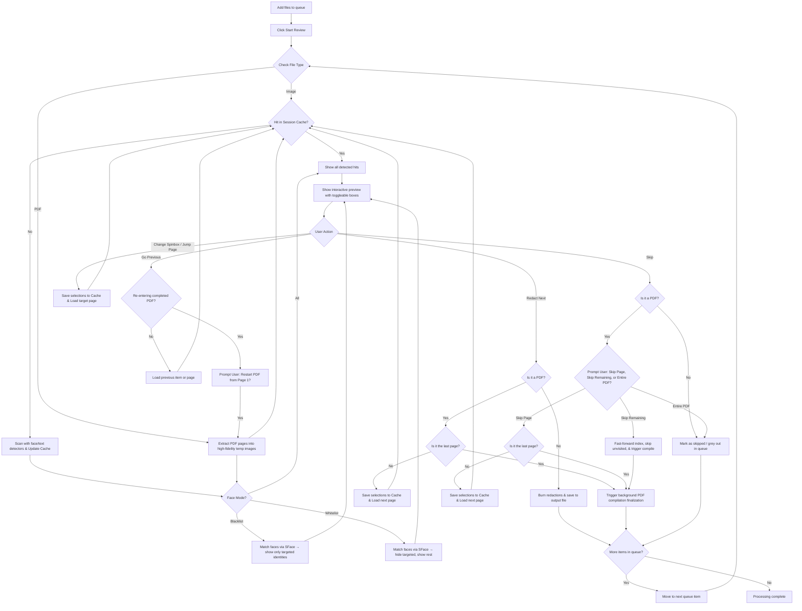

---

## Face Identity Recognition Workflow

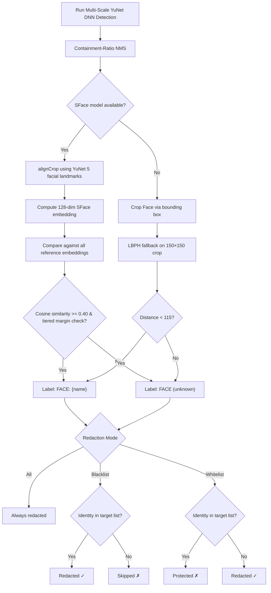

---

## Body Detection & Face-Body Hybrid Mapping Workflow

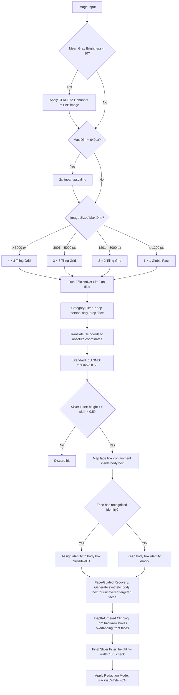

---

## Hybrid Digital & OCR Text Detection Workflow

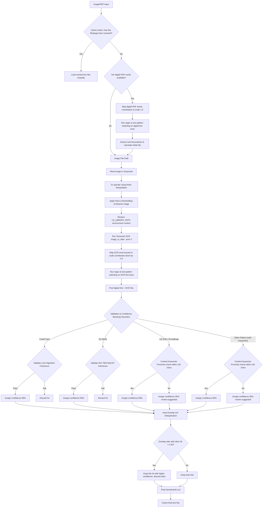

---

## Processing & Redaction Sequence Diagram

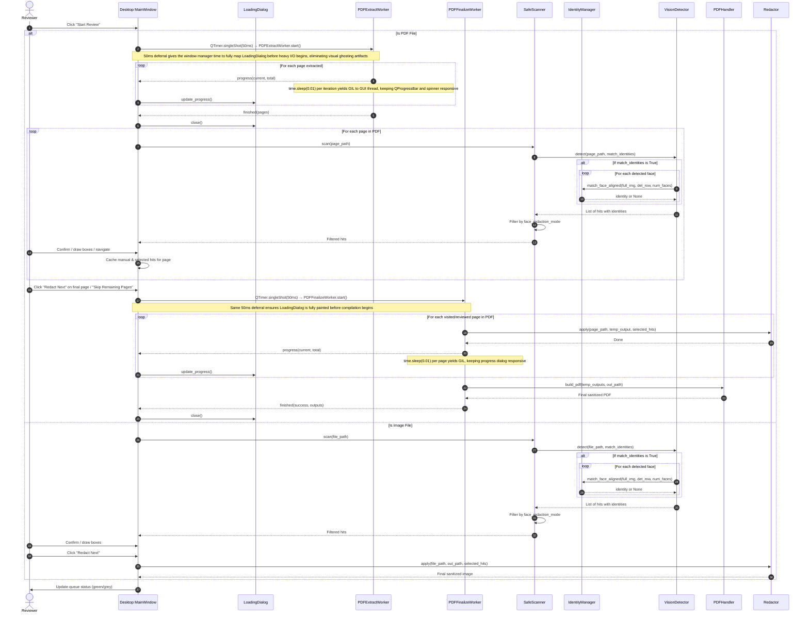

---

## Identity Quick-Add Workflow

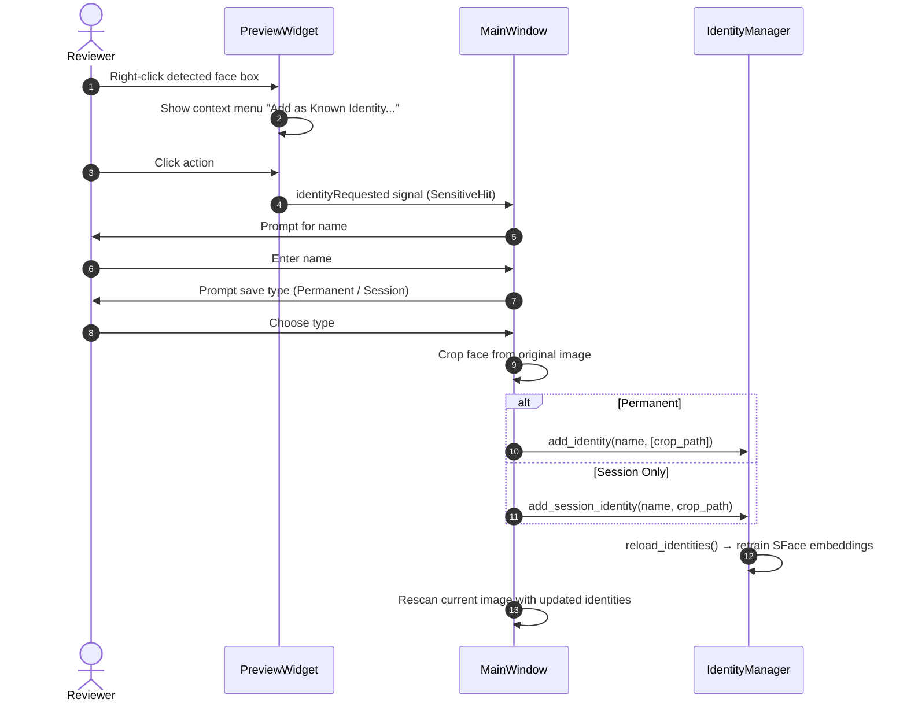

---

## Reference Photo Cropping & Biometric Training Workflow

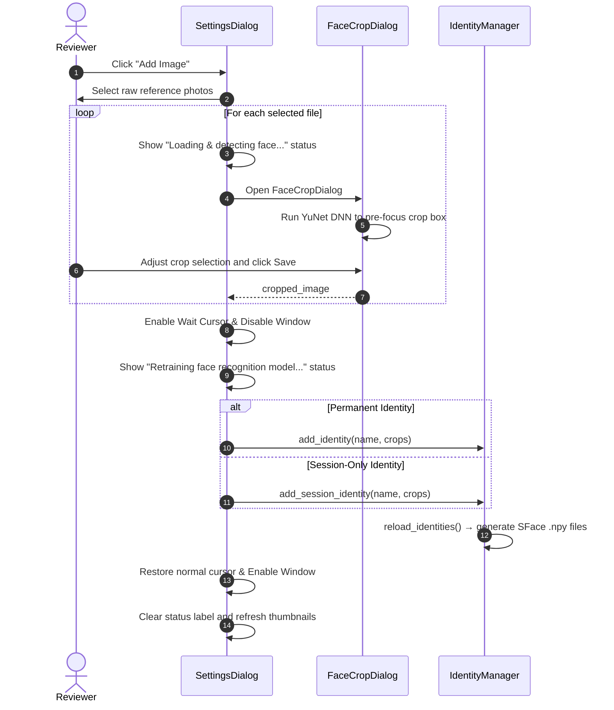

---

## Persistent Custom Bounding Box Smart Range Scope Workflow

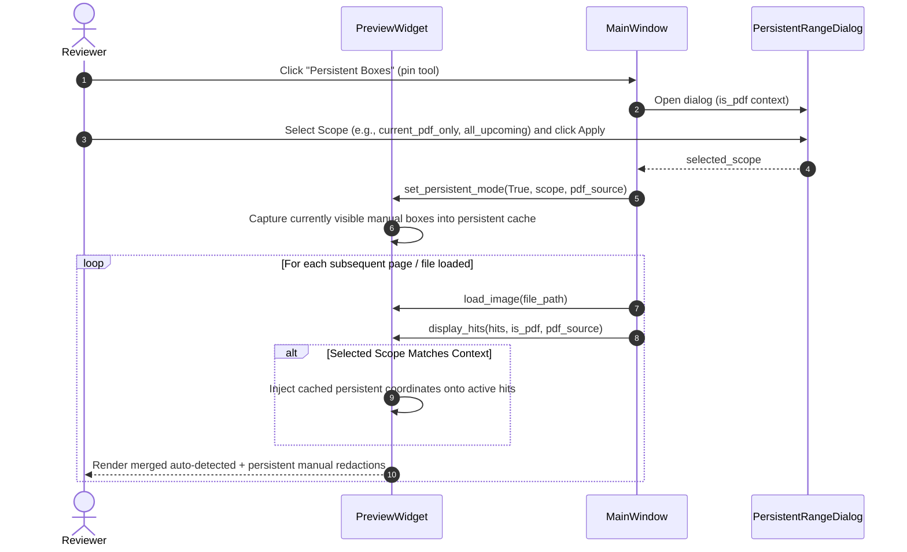

---

## Unified Temp Resource Lifecycle & Exit Routines

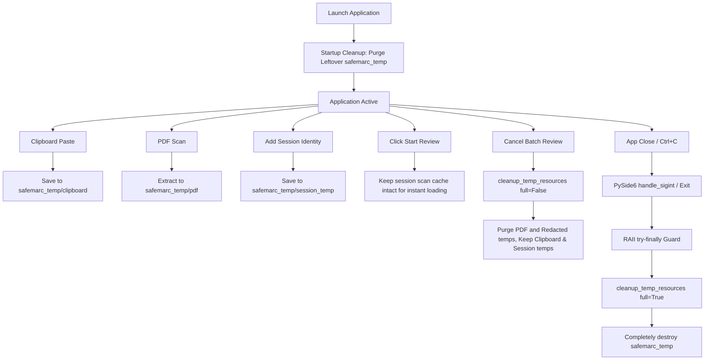

---

## Checkbox Selections Persistence & Manual Box Restoration Workflow

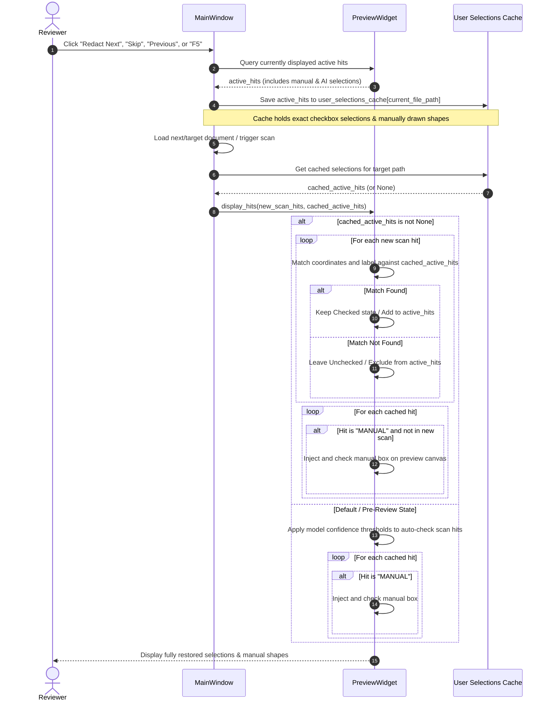

---

## Keyboard Focus & Tabbing Mode Lifecycle Workflow

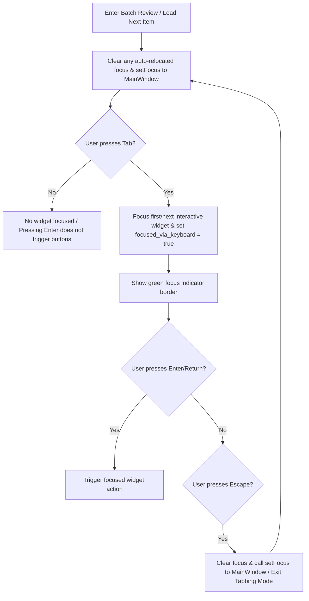

## Identity Renaming Workflow

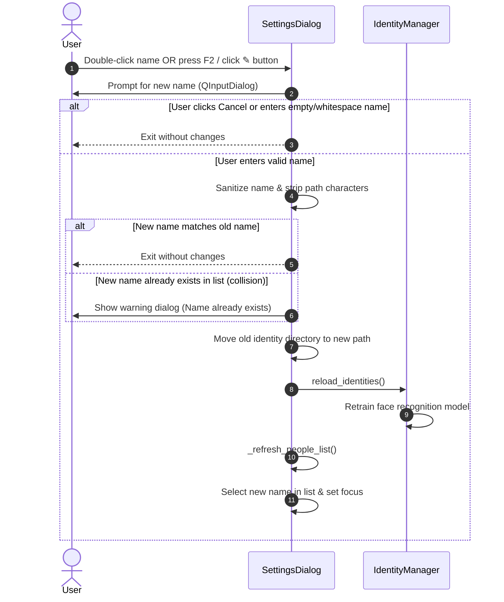

---

## Identity Export & Import Workflow

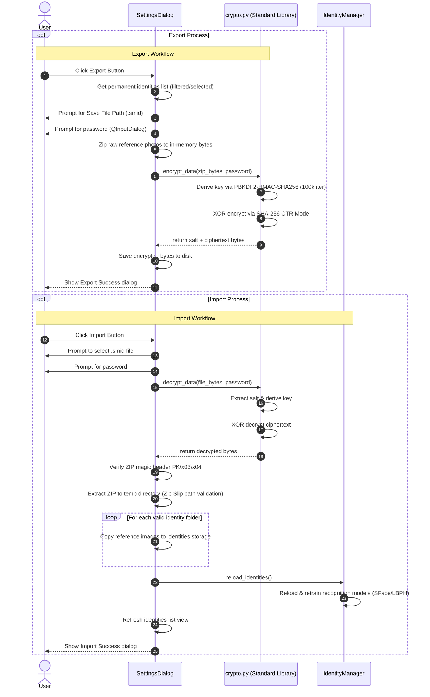

---

## Custom Patterns Export & Import Workflow

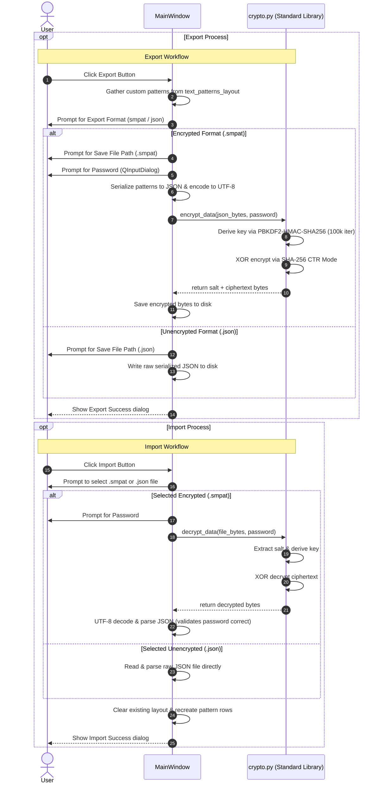
