# List of Figures

### Figure 3.1 Vision Engine Evolution and Deep Learning Model Migration
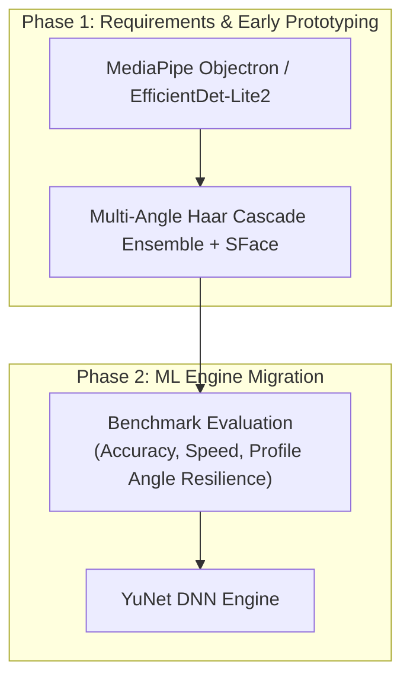
```mermaid
flowchart TD
    subgraph P1["Phase 1: Requirements & Early Prototyping"]
        A["MediaPipe Objectron / EfficientDet-Lite2"] --> B["Multi-Angle Haar Cascade Ensemble + SFace"]
    end

    subgraph P2["Phase 2: ML Engine Migration"]
        C["Benchmark Evaluation<br/>(Accuracy, Speed, Profile Angle Resilience)"] --> D["YuNet DNN Engine"]
    end

    B --> C
```

### Figure 3.2 Dual-Layer Text Processing Engine Iterations
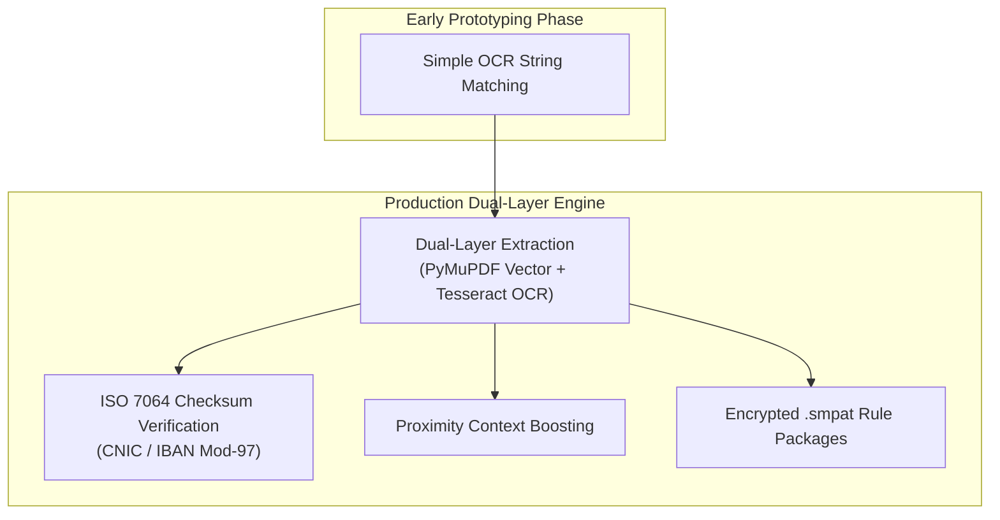
```mermaid
flowchart TD
    subgraph P_EARLY["Early Prototyping Phase"]
        T1["Simple OCR String Matching"]
    end

    subgraph P_PROD["Production Dual-Layer Engine"]
        T2["Dual-Layer Extraction<br/>(PyMuPDF Vector + Tesseract OCR)"]
        T3["ISO 7064 Checksum Verification<br/>(CNIC / IBAN Mod-97)"]
        T4["Proximity Context Boosting"]
        T5["Encrypted .smpat Rule Packages"]

        T2 --> T3
        T2 --> T4
        T2 --> T5
    end

    T1 --> T2
```

### Figure 3.3 SafeMARC System Dependency Architecture
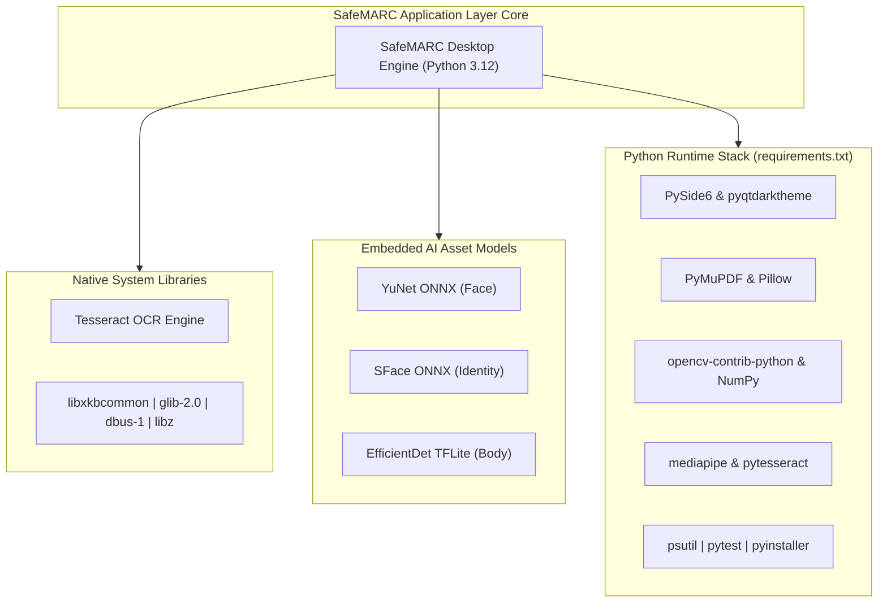
```mermaid
flowchart TD
    subgraph APP["SafeMARC Application Layer Core"]
        Engine["SafeMARC Desktop Engine (Python 3.12)"]
    end

    subgraph OS_LAYER["Native System Libraries"]
        Tess["Tesseract OCR Engine"]
        NativeLibs["libxkbcommon | glib-2.0 | dbus-1 | libz"]
    end

    subgraph AI_ASSETS["Embedded AI Asset Models"]
        YuNet["YuNet ONNX (Face)"]
        SFace["SFace ONNX (Identity)"]
        EffDet["EfficientDet TFLite (Body)"]
    end

    subgraph PY_STACK["Python Runtime Stack (requirements.txt)"]
        GUI["PySide6 & pyqtdarktheme"]
        DocEngine["PyMuPDF & Pillow"]
        CV_Math["opencv-contrib-python & NumPy"]
        Wrappers["mediapipe & pytesseract"]
        System_QA["psutil | pytest | pyinstaller"]
    end

    Engine --> OS_LAYER
    Engine --> AI_ASSETS
    Engine --> PY_STACK
```

### Figure 3.4 SafeMARC Project Schedule (48-Week Development Timeline Gantt Chart)
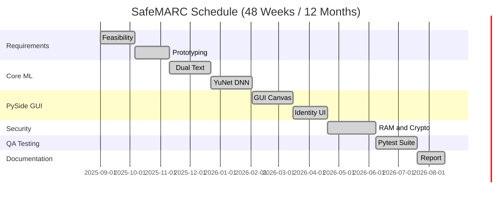
```mermaid
%%{init: {'gantt': {'leftPadding': 160}}}%%
gantt
    title SafeMARC Schedule (48 Weeks / 12 Months)
    dateFormat YYYY-MM-DD
    section Requirements
        Feasibility        :done, p1_1, 2025-09-01, 35d
        Prototyping        :done, p1_2, after p1_1, 35d
    section Core ML
        Dual Text          :done, p2_1, after p1_2, 42d
        YuNet DNN          :done, p2_2, after p2_1, 42d
    section PySide GUI
        GUI Canvas         :done, p3_1, after p2_2, 42d
        Identity UI        :done, p3_2, after p3_1, 35d
    section Security
        RAM and Crypto     :done, p4_1, after p3_2, 49d
    section QA Testing
        Pytest Suite       :done, p5_1, after p4_1, 42d
    section Documentation
        Report             :done, p6_1, after p5_1, 28d
```

### Figure 3.5 SafeMARC Use Case Architecture Diagram
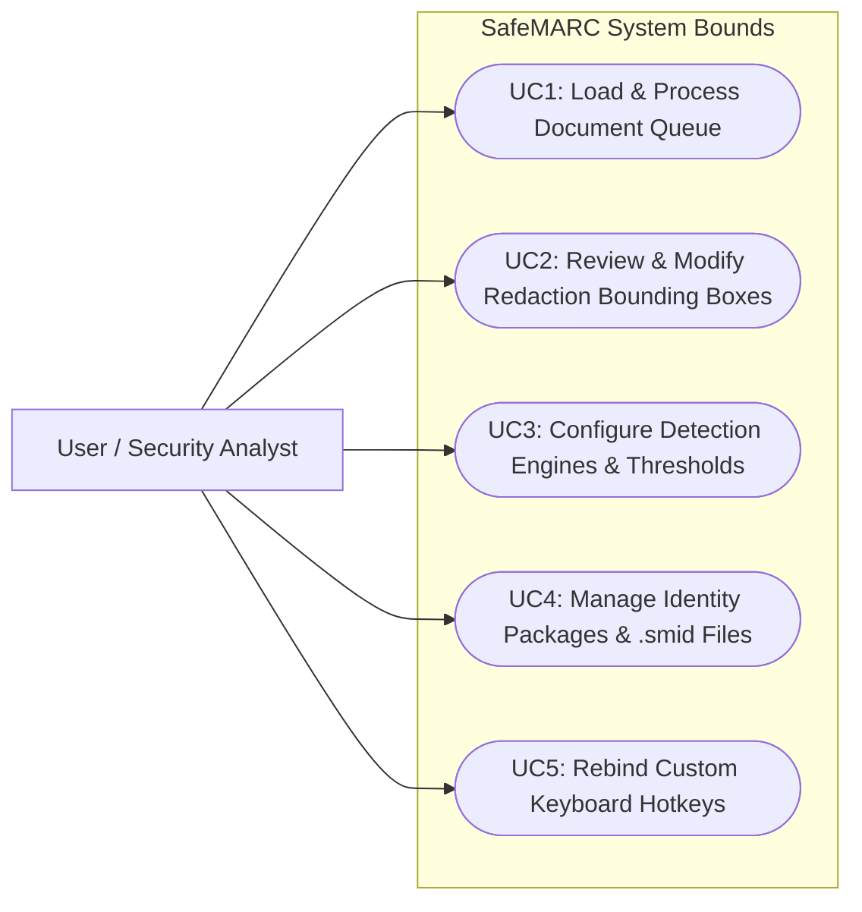
```mermaid
flowchart LR
    Actor["User / Security Analyst"]

    subgraph System["SafeMARC System Bounds"]
        UC1(["UC1: Load & Process Document Queue"])
        UC2(["UC2: Review & Modify Redaction Bounding Boxes"])
        UC3(["UC3: Configure Detection Engines & Thresholds"])
        UC4(["UC4: Manage Identity Packages & .smid Files"])
        UC5(["UC5: Rebind Custom Keyboard Hotkeys"])
    end

    Actor --> UC1
    Actor --> UC2
    Actor --> UC3
    Actor --> UC4
    Actor --> UC5
```

### Figure 4.1 SafeMARC Subsystem Architecture Overview
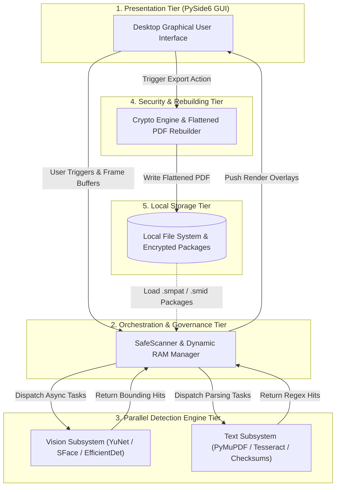
```mermaid
flowchart TD
    subgraph S1["1. Presentation Tier (PySide6 GUI)"]
        UI_Core["Desktop Graphical User Interface"]
    end

    subgraph S2["2. Orchestration & Governance Tier"]
        SCAN_Core["SafeScanner & Dynamic RAM Manager"]
    end

    subgraph S3["3. Parallel Detection Engine Tier"]
        VISION_Core["Vision Subsystem (YuNet / SFace / EfficientDet)"]
        TEXT_Core["Text Subsystem (PyMuPDF / Tesseract / Checksums)"]
    end

    subgraph S4["4. Security & Rebuilding Tier"]
        EXP_Core["Crypto Engine & Flattened PDF Rebuilder"]
    end

    subgraph S5["5. Local Storage Tier"]
        DISK_Core[("Local File System & Encrypted Packages")]
    end

    UI_Core -->|"User Triggers & Frame Buffers"| SCAN_Core
    SCAN_Core -->|"Dispatch Async Tasks"| VISION_Core
    SCAN_Core -->|"Dispatch Parsing Tasks"| TEXT_Core
    VISION_Core -->|"Return Bounding Hits"| SCAN_Core
    TEXT_Core -->|"Return Regex Hits"| SCAN_Core
    SCAN_Core -->|"Push Render Overlays"| UI_Core
    UI_Core -->|"Trigger Export Action"| EXP_Core
    DISK_Core -.->|"Load .smpat / .smid Packages"| SCAN_Core
    EXP_Core -->|"Write Flattened PDF"| DISK_Core
```

### Figure 4.2 Subsystem 1: Presentation Tier Component Architecture
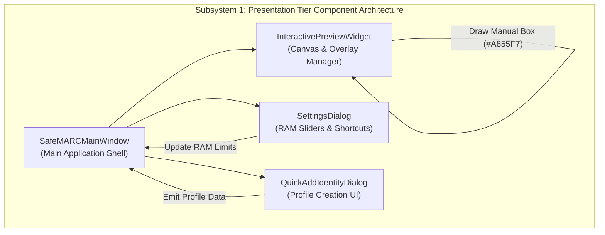
```mermaid
flowchart TD
    subgraph UI_SUB["Subsystem 1: Presentation Tier Component Architecture"]
        MW["SafeMARCMainWindow<br/>(Main Application Shell)"]
        PW["InteractivePreviewWidget<br/>(Canvas & Overlay Manager)"]
        SD["SettingsDialog<br/>(RAM Sliders & Shortcuts)"]
        IDD["QuickAddIdentityDialog<br/>(Profile Creation UI)"]

        MW --> PW
        MW --> SD
        MW --> IDD
    end

    PW -->|"Draw Manual Box (#A855F7)"| PW
    SD -->|"Update RAM Limits"| MW
    IDD -->|"Emit Profile Data"| MW
```

### Figure 4.3 Subsystem 2: Orchestration & Governance Component Architecutre
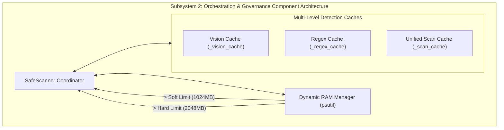
```mermaid
flowchart TD
    subgraph ORCH_SUB["Subsystem 2: Orchestration & Governance Component Architecture"]
        SCAN["SafeScanner Coordinator"]
        
        subgraph CACHE_SYS["Multi-Level Detection Caches"]
            VC["Vision Cache (_vision_cache)"]
            RC["Regex Cache (_regex_cache)"]
            SC["Unified Scan Cache (_scan_cache)"]
        end

        RAM["Dynamic RAM Manager (psutil)"]

        SCAN <--> CACHE_SYS
        SCAN <--> RAM
    end

    RAM -->|"> Soft Limit (1024MB)"| SCAN
    RAM -->|"> Hard Limit (2048MB)"| SCAN
```

### Figure 4.4 Subsystem 3: Vision Detection Component Architecture
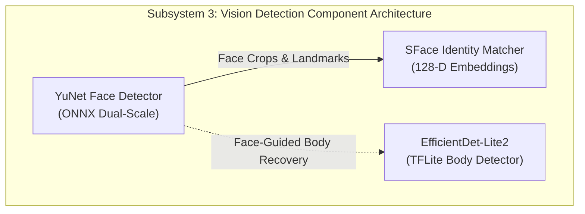
```mermaid
flowchart TD
    subgraph VIS_SUB["Subsystem 3: Vision Detection Component Architecture"]
        YN["YuNet Face Detector<br/>(ONNX Dual-Scale)"]
        SF["SFace Identity Matcher<br/>(128-D Embeddings)"]
        ED["EfficientDet-Lite2<br/>(TFLite Body Detector)"]

        YN -->|"Face Crops & Landmarks"| SF
        YN -.->|"Face-Guided Body Recovery"| ED
    end
```

### Figure 4.5 Subsystem 4: Text Parsing Component Architecture
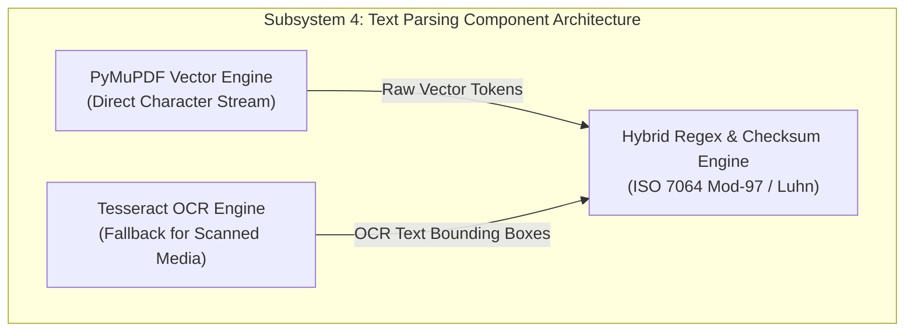
```mermaid
flowchart TD
    subgraph TXT_SUB["Subsystem 4: Text Parsing Component Architecture"]
        PDF["PyMuPDF Vector Engine<br/>(Direct Character Stream)"]
        TESS["Tesseract OCR Engine<br/>(Fallback for Scanned Media)"]
        CHK["Hybrid Regex & Checksum Engine<br/>(ISO 7064 Mod-97 / Luhn)"]

        PDF -->|"Raw Vector Tokens"| CHK
        TESS -->|"OCR Text Bounding Boxes"| CHK
    end
```

### Figure 4.6 Subsystem 5: Security & Export Component Architecture
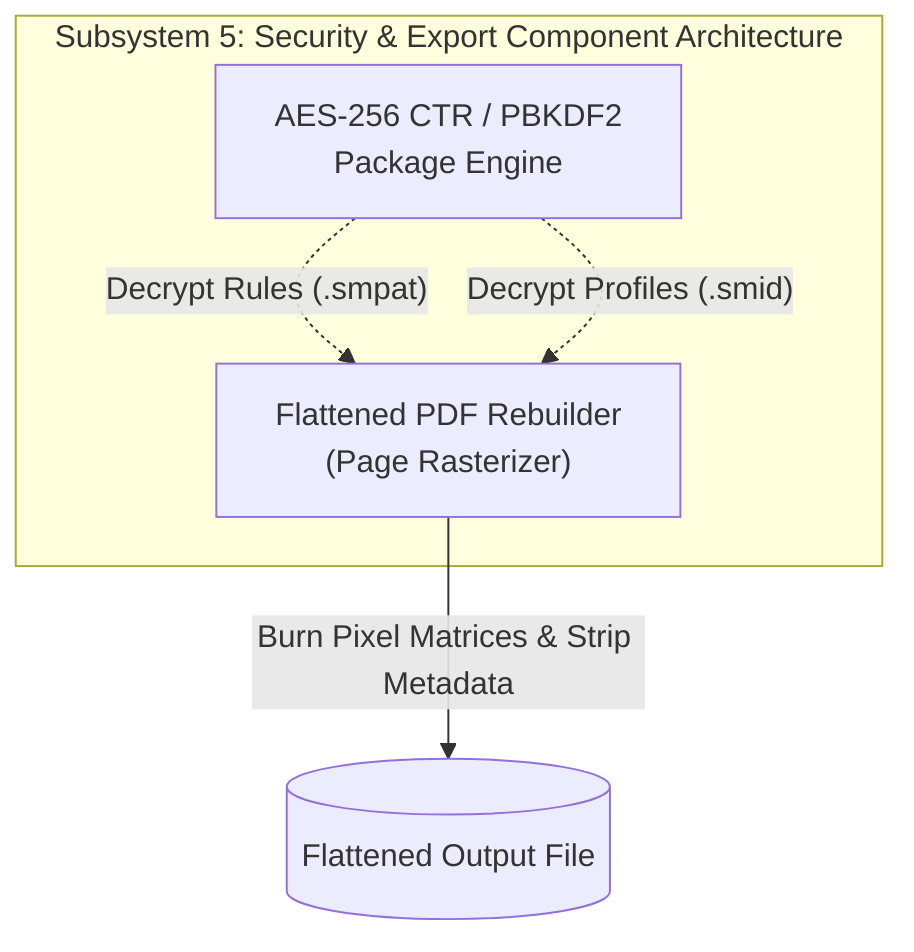
```mermaid
flowchart TD
    subgraph EXP_SUB["Subsystem 5: Security & Export Component Architecture"]
        CRYPTO["AES-256 CTR / PBKDF2<br/>Package Engine"]
        REBUILD["Flattened PDF Rebuilder<br/>(Page Rasterizer)"]

        CRYPTO -.->|"Decrypt Rules (.smpat)"| REBUILD
        CRYPTO -.->|"Decrypt Profiles (.smid)"| REBUILD
    end

    REBUILD -->|"Burn Pixel Matrices & Strip Metadata"| Out[("Flattened Output File")]
```

### Figure 4.7 Conceptual Data Transition Pipeline Across Redaction Phases
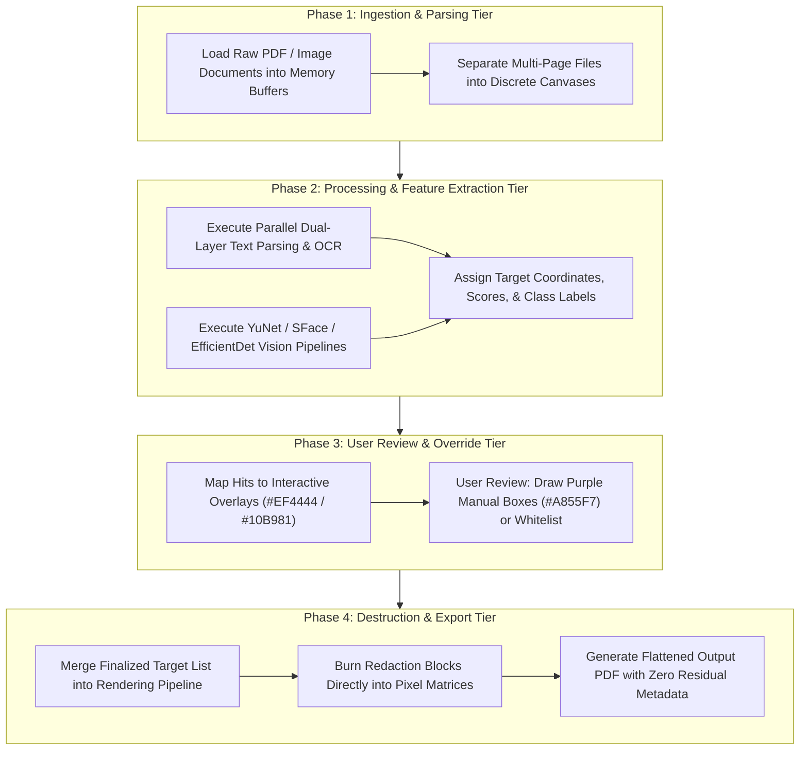
```mermaid
flowchart TD
    subgraph P1["Phase 1: Ingestion & Parsing Tier"]
        A1["Load Raw PDF / Image Documents into Memory Buffers"]
        A2["Separate Multi-Page Files into Discrete Canvases"]
        A1 --> A2
    end

    subgraph P2["Phase 2: Processing & Feature Extraction Tier"]
        B1["Execute Parallel Dual-Layer Text Parsing & OCR"]
        B2["Execute YuNet / SFace / EfficientDet Vision Pipelines"]
        B3["Assign Target Coordinates, Scores, & Class Labels"]
        B1 & B2 --> B3
    end

    subgraph P3["Phase 3: User Review & Override Tier"]
        C1["Map Hits to Interactive Overlays (#EF4444 / #10B981)"]
        C2["User Review: Draw Purple Manual Boxes (#A855F7) or Whitelist"]
        C1 --> C2
    end

    subgraph P4["Phase 4: Destruction & Export Tier"]
        D1["Merge Finalized Target List into Rendering Pipeline"]
        D2["Burn Redaction Blocks Directly into Pixel Matrices"]
        D3["Generate Flattened Output PDF with Zero Residual Metadata"]
        D1 --> D2 --> D3
    end

    P1 --> P2 --> P3 --> P4
```

### Figure 4.8 High-Level Sequence Diagram for Automated Document Processing Workflow
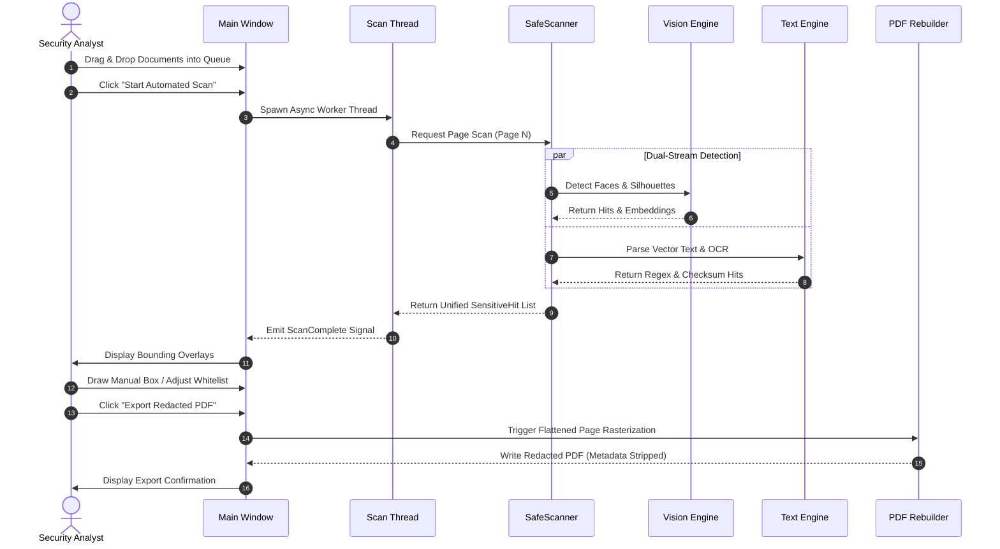
```mermaid
sequenceDiagram
    autonumber
    actor User as Security Analyst
    participant GUI as Main Window
    participant Worker as Scan Thread
    participant Scanner as SafeScanner
    participant Vision as Vision Engine
    participant Text as Text Engine
    participant Exporter as PDF Rebuilder

    User->>GUI: Drag & Drop Documents into Queue
    User->>GUI: Click "Start Automated Scan"
    GUI->>Worker: Spawn Async Worker Thread
    Worker->>Scanner: Request Page Scan (Page N)
    
    par Dual-Stream Detection
        Scanner->>Vision: Detect Faces & Silhouettes
        Vision-->>Scanner: Return Hits & Embeddings
    and
        Scanner->>Text: Parse Vector Text & OCR
        Text-->>Scanner: Return Regex & Checksum Hits
    end

    Scanner-->>Worker: Return Unified SensitiveHit List
    Worker-->>GUI: Emit ScanComplete Signal
    GUI->>User: Display Bounding Overlays
    User->>GUI: Draw Manual Box / Adjust Whitelist
    User->>GUI: Click "Export Redacted PDF"
    GUI->>Exporter: Trigger Flattened Page Rasterization
    Exporter-->>GUI: Write Redacted PDF (Metadata Stripped)
    GUI->>User: Display Export Confirmation
```

### Figure 4.9 Low-Level Subsystem Class Interaction Architecture Diagram
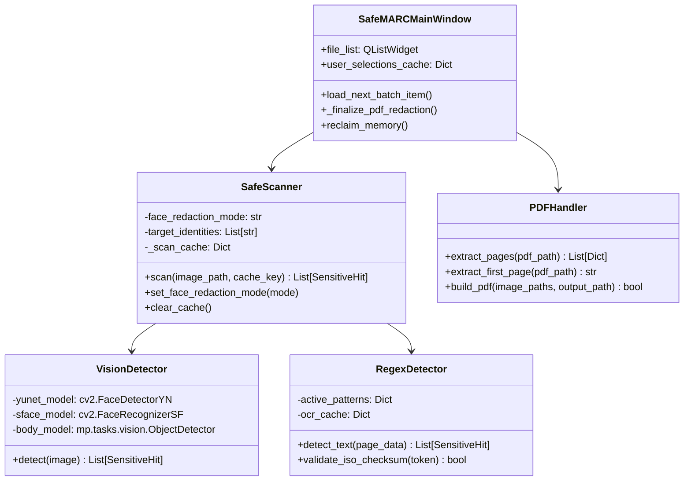
```mermaid
classDiagram
    class SafeMARCMainWindow {
        +file_list: QListWidget
        +user_selections_cache: Dict
        +load_next_batch_item()
        +_finalize_pdf_redaction()
        +reclaim_memory()
    }

    class SafeScanner {
        -face_redaction_mode: str
        -target_identities: List[str]
        -_scan_cache: Dict
        +scan(image_path, cache_key) List[SensitiveHit]
        +set_face_redaction_mode(mode)
        +clear_cache()
    }

    class VisionDetector {
        -yunet_model: cv2.FaceDetectorYN
        -sface_model: cv2.FaceRecognizerSF
        -body_model: mp.tasks.vision.ObjectDetector
        +detect(image) List[SensitiveHit]
    }

    class RegexDetector {
        -active_patterns: Dict
        -ocr_cache: Dict
        +detect_text(page_data) List[SensitiveHit]
        +validate_iso_checksum(token) bool
    }

    class PDFHandler {
        +extract_pages(pdf_path) List[Dict]
        +extract_first_page(pdf_path) str
        +build_pdf(image_paths, output_path) bool
    }

    SafeMARCMainWindow --> SafeScanner
    SafeMARCMainWindow --> PDFHandler
    SafeScanner --> VisionDetector
    SafeScanner --> RegexDetector
```

### Figure 4.10 Encrypted Container Payload (.smpat / .smid)
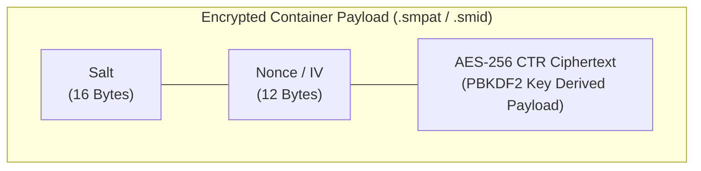
```mermaid
flowchart LR
    subgraph Container["Encrypted Container Payload (.smpat / .smid)"]
        direction LR
        Salt["Salt<br/>(16 Bytes)"] --- Nonce["Nonce / IV<br/>(12 Bytes)"] --- Ciphertext["AES-256 CTR Ciphertext<br/>(PBKDF2 Key Derived Payload)"]
    end
```

### Figure 4.11 Entity-Relationship Diagram (ERD) for Embedded Local Storage and Package Schemas
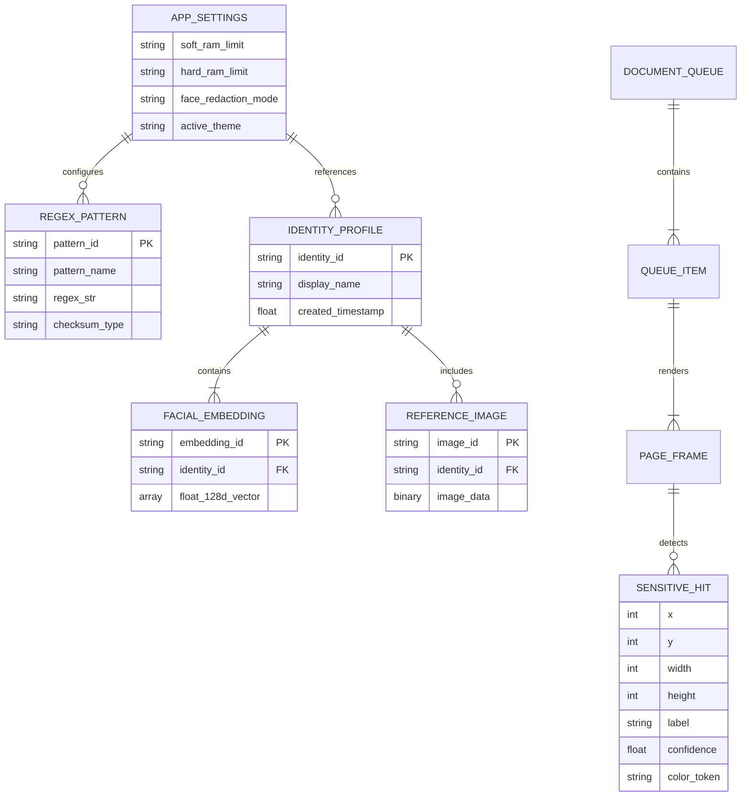
```mermaid
erDiagram
    APP_SETTINGS ||--o{ REGEX_PATTERN : configures
    APP_SETTINGS ||--o{ IDENTITY_PROFILE : references
    IDENTITY_PROFILE ||--|{ FACIAL_EMBEDDING : contains
    IDENTITY_PROFILE ||--o{ REFERENCE_IMAGE : includes
    
    DOCUMENT_QUEUE ||--|{ QUEUE_ITEM : contains
    QUEUE_ITEM ||--|{ PAGE_FRAME : renders
    PAGE_FRAME ||--o{ SENSITIVE_HIT : detects

    APP_SETTINGS {
        string soft_ram_limit
        string hard_ram_limit
        string face_redaction_mode
        string active_theme
    }

    REGEX_PATTERN {
        string pattern_id PK
        string pattern_name
        string regex_str
        string checksum_type
    }

    IDENTITY_PROFILE {
        string identity_id PK
        string display_name
        float created_timestamp
    }

    FACIAL_EMBEDDING {
        string embedding_id PK
        string identity_id FK
        array float_128d_vector
    }

    REFERENCE_IMAGE {
        string image_id PK
        string identity_id FK
        binary image_data
    }

    SENSITIVE_HIT {
        int x
        int y
        int width
        int height
        string label
        float confidence
        string color_token
    }
```

### Figure 4.12 SafeMARC Primary Application Shell Initial Launch Interface
*(Image placeholder)*

### Figure 4.13 Batch Document Queue Sidebar Displaying Active File Ingestion
*(Image placeholder)*

### Figure 4.14 Interactive Review Canvas Rendering Ruby Red (#EF4444), Emerald Green (#10B981), and Royal Purple (#A855F7) Redaction Overlays
*(Image placeholder)*

### Figure 4.15 Interactive Canvas Context Menu Quick-Add Identity Registration Prompt
*(Image placeholder)*

### Figure 4.16 Biometric Identity Manager Profile Management Dialog
*(Image placeholder)*

### Figure 4.17 Biometric Facial Reference Alignment and Auto-Crop Adjustment Interface
*(Image placeholder)*

### Figure 4.18 System Settings Dialog — General Configuration Tab
*(Image placeholder)*

### Figure 4.19 System Settings Dialog — Detection Models and Neural Confidence Thresholds Tab
*(Image placeholder)*

### Figure 4.20 System Settings Dialog — Dynamic Memory Ceiling and RAM Governance Tab
*(Image placeholder)*

### Figure 4.21 System Settings Dialog — Keyboard Shortcut Configuration and Event Filter Tab
*(Image placeholder)*

### Figure 5.1 Technical Subsystem Migration and Engineering Evolution Strategy
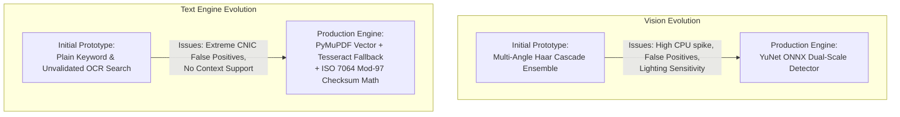
```mermaid
flowchart TD
    subgraph Vision Evolution
        V1["Initial Prototype:<br/>Multi-Angle Haar Cascade Ensemble"] -->|Issues: High CPU spike, False Positives,<br/>Lighting Sensitivity| V2["Production Engine:<br/>YuNet ONNX Dual-Scale Detector"]
    end

    subgraph Text Engine Evolution
        T1["Initial Prototype:<br/>Plain Keyword & Unvalidated OCR Search"] -->|Issues: Extreme CNIC False Positives,<br/>No Context Support| T2["Production Engine:<br/>PyMuPDF Vector + Tesseract Fallback<br/>+ ISO 7064 Mod-97 Checksum Math"]
    end
```

### Figure 5.2 Dynamic Heap Memory Monitoring and Multi-Tiered Cache Reclamation Flowchart
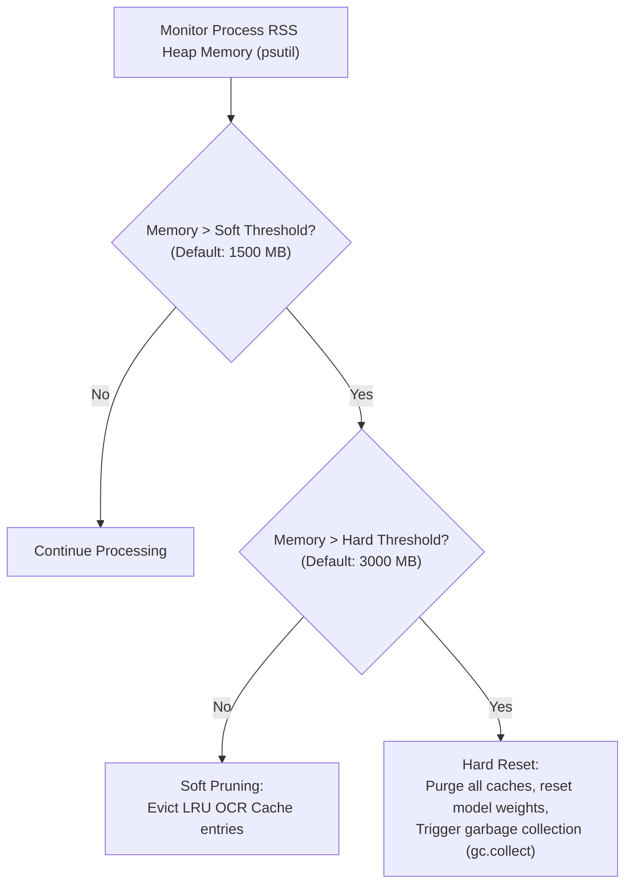
```mermaid
flowchart TD
    A["Monitor Process RSS Heap Memory (psutil)"] --> B{"Memory > Soft Threshold?<br/>(Default: 1500 MB)"}
    B -- No --> C["Continue Processing"]
    B -- Yes --> D{"Memory > Hard Threshold?<br/>(Default: 3000 MB)"}
    D -- No --> E["Soft Pruning:<br/>Evict LRU OCR Cache entries"]
    D -- Yes --> F["Hard Reset:<br/>Purge all caches, reset model weights,<br/>Trigger garbage collection (gc.collect)"]
```

### Figure 6.1 QA Strategy Evolution
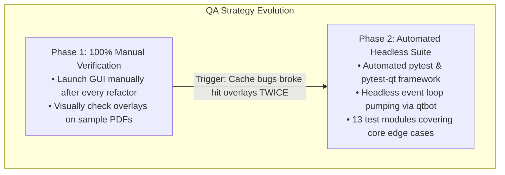
```mermaid
flowchart TD
    subgraph QA Strategy Evolution
        M1["Phase 1: 100% Manual Verification<br/>• Launch GUI manually after every refactor<br/>• Visually check overlays on sample PDFs"] -->|Trigger: Cache bugs broke hit overlays TWICE| M2["Phase 2: Automated Headless Suite<br/>• Automated pytest & pytest-qt framework<br/>• Headless event loop pumping via qtbot<br/>• 13 test modules covering core edge cases"]
    end
```

### Figure 6.2 CLI-to-GUI Interface Shift and Command Line Refactoring
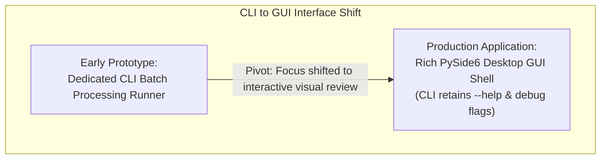
```mermaid
flowchart TD
    subgraph CLI to GUI Interface Shift
        C1["Early Prototype:<br/>Dedicated CLI Batch Processing Runner"] -->|Pivot: Focus shifted to interactive visual review| C2["Production Application:<br/>Rich PySide6 Desktop GUI Shell<br/>(CLI retains --help & debug flags)"]
    end
```

### Figure 6.3 Process RSS Memory Governance and Dynamic Cache Reclamation Flow
```mermaid
flowchart TD
    A["Monitor Process RSS Heap Memory (psutil)"] --> B{"Memory > Soft Threshold?<br/>(Default: 1500 MB)"}
    B -- No --> C["Continue Processing"]
    B -- Yes --> D{"Memory > Hard Threshold?<br/>(Default: 3000 MB)"}
    D -- No --> E["Soft Pruning:<br/>Evict LRU OCR Cache entries"]
    D -- Yes --> F["Hard Reset:<br/>Purge all caches, reset model weights,<br/>Trigger garbage collection (gc.collect)"]
```
